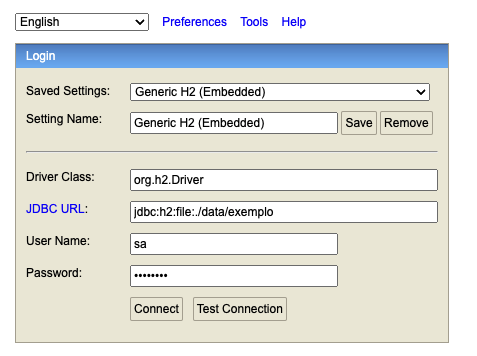

# Aula 4 - Arquitetura de Camadas e Persistência de Dados

## Introdução
---

Na aula de hoje iremos evoluir os conhecimentos adquiridos até então no Reset. A partir de agora, iremos focar em como desenvolver nossa aplicação seguindo uma arquitetura robusta, que traga uma série de boas práticas para o nosso projeto, nos apoiando a construir uma aplicação escalável e de fácil manutenção. 

Também iremos ligar a nossa aplicação a uma camada de persistência de dados, que irá persistir em uma estrutura em disco os dados do nosso programa. Então lets`s dalhe !!!!

## Modelo de Camadas
---

Até então vínhamos construindo nossa aplicação inteiramente na camada de Controle (nossas controllers do Spring). Durante o desafio-3 do ResetFlix propomos um modelo mais refinado e estrutura afim de organizar a nossa aplicação de uma melhor forma.

Vejamos um exemplo de código da Aula 3.

```java
@RestController
@RequestMapping("/filme")
public class FilmeController {

    private static List<Filme> filmes = new ArrayList<>();

    @PostMapping
    public ResponseEntity<Filme> cadastrarFilme(@RequestBody Filme filme) {
        Filme filmeExistente = buscarPorNome(filme.getNome());
        if (filmeExistente != null) {
            return ResponseEntity.badRequest().build();
        }
        filmes.add(filme);
        return ResponseEntity.ok(filme);
    }

    @GetMapping
    public List<Filme> consultarTodos() {
        return filmes;
    }

    @GetMapping("/{nome}")
    public Filme buscarFilmePeloNome(@PathVariable String nome) {
        return buscarPorNome(nome);
    }

    @DeleteMapping("/{nome}")
    public void deletarFilme(@PathVariable String nome) {
        Filme filme = buscarFilmePeloNome(nome);
        if (filme != null) {
            filmes.remove(filme);
        }
    }

    @PutMapping
    public Filme atualizarFilme(@RequestBody Filme filme) {
        Filme filmeExistente = buscarFilmePeloNome(filme.getNome());

        if (filmeExistente != null) {
            filmes.remove(filmeExistente);
            filmes.add(filme);
            return filme;
        }
        return null;
    }

    private Filme buscarPorNome(String nome) {
        for (Filme filme : filmes) {
            if (filme.getNome().equals(nome)) {
                return filme;
            }
        }
        return null;
    }
}
```

Podemos notar que neste exemplo exibido em aula, estamos fazendo toda a nossa lógica do CRUD de filmes na Controller. A classe é responssável por mapear os endpoints/serviços que estamos expondo na nossa API, além de validar as regras de negócio e persistir nossos filmes na Lista onde estamos salvando nossos dados. Podemos nos questionar sobre os seguintes pontos:

- Essa classe não está fazendo coisas de mais ?
- Quais motivos poderiam gerar uma modificação nesta classe ?
- Estamos respeitando os princípios de OO ? Essa classe tem uma responsabilidade única ?
- E se tivermos uma alteração na forma de persistir nossos dados, as regras de negócio vão sofrer algum impacto e gerar mudanças na classe responsável ?
- Dentre outras perguntinhas mais :)

### E como podemos melhorar isso e atender os questionamentos acima ?

Bom, dentro dos princípios e boas práticas de desenvolvimento de um código orientado a objetos, podemos frizar o seguinte.

**Prioncípio da responsabilidade única** -> O princípio da responsabilidade única tem como regra que uma classe deve possuir uma, e apenas uma, responsabilidade. Pode-se traduzir isso em “uma classe deve ter apenas um motivo para mudar”.

De acordo com o príncipio descrito acima, vamos tentar segregar as responsabilidades da nossa aplicação e elaborar um modelo com 3 camadas, onde cada uma será responsável por uma parte específica do nosso programa. 

---

## Camada de Controle
---
Aqui é onde iremos situar a nossa controller do Spring. Ela terá como única responsabilidade realizar o mapeamento dos nossos endpoints/serviços que serão expostos em nossa API. Aqui iremos informar quais parâmetros recebemos em cada operação, o retorno que teremos no corpo da resposta, além dos status codes retornados. Segue abaixo um exemplo de como ficará a estrutura de nossa controller. 

```java

@RestController
@RequestMapping("/filme")
public class FilmeController {

    private static List<Filme> filmes = new ArrayList<>();

    private FilmeService filmeService = new FilmeService();

    @PostMapping
    public ResponseEntity<Filme> cadastrarFilme(@RequestBody Filme filme) {
        try {
            Filme filmeSalvo = filmeService.salvar(filme);
            return ResponseEntity.ok(filmeSalvo);
        } catch (FilmeJaExistenteException ex) {
            return ResponseEntity.badRequest().build();
        }
    }

    @GetMapping
    public List<Filme> consultarTodos() {
        return filmeService.listarTodos();
    }

    @GetMapping("/{nome}")
    public Filme buscarFilmePeloNome(@PathVariable String nome) {
        return filmeService.buscarPorNome(nome);
    }

    @DeleteMapping("/{nome}")
    public ResponseEntity deletarFilme(@PathVariable String nome) {
        try {
            filmeService.deletar(nome);
            return ResponseEntity.ok().build();
        } catch (FilmeNaoExistenteException e) {
            return ResponseEntity.badRequest().build();
        }
    }

    @PutMapping
    public ResponseEntity<Filme> atualizarFilme(@RequestBody Filme filme) {
        try {
            return ResponseEntity.ok(filmeService.atualizar(filme));
        } catch (FilmeNaoExistenteException e) {
            return ResponseEntity.badRequest().build();
        }
    }

}

```

--- 

## Camada de Serviço
---

É a camada responsável por processar nossas regras de negócio e interagir com nossa camada de persistência. É aqui que realizaremos todas validações de negócio da nossa aplicação, aplicaremos regras adequadas a cada fluxo sendo desenvolvido, no final podendo se ligar com a camada de persistência.

Abaixo um exemplo da implementação de uma classe de serviço.

```java
public class FilmeService {

    private FilmeRepository repository = new FilmeRepository();

    public Filme salvar(Filme filme) throws FilmeJaExistenteException {
       Filme filmeJaExistente = repository.findByName(filme.getNome());

       if (filmeJaExistente != null) {
           throw new FilmeJaExistenteException("Filme com o nome " + filme.getNome() + " já existe");
       }
       repository.save(filme);
       return filme;
    }

    public List<Filme> listarTodos() {
        return repository.findAll();
    }

    public Filme buscarPorNome(String nome) {
        return repository.findByName(nome);
    }

    public void deletar(String nomeFilme) throws FilmeNaoExistenteException {
        Filme filme = buscarPorNome(nomeFilme);
        if (filme == null) {
            throw new FilmeNaoExistenteException("Filme com o nome " + nomeFilme + " não existe");
        }
        repository.delete(filme);
    }

    public Filme atualizar(Filme filme) throws FilmeNaoExistenteException {
        Filme filmeJaCadastrado = buscarPorNome(filme.getNome());
        if (filme == null) {
            throw new FilmeNaoExistenteException("Filme com o nome " + filme.getNome() + " não existe");
        }
        return repository.update(filme);
    }
}
```

## Camada de Persistência (Repository)
---

É aqui onde lidaremos com a persistência dos nossos dados. A persistência pode ser realizada de diversas formas, através de uma estrutura em memória (Listas/Arrays), em arquivos, em um sistema de Banco de dados, dentre outras possibilidades. Segue nosso primeiro exemplo de um repositório de dados, implementado em memória.

```java
package br.com.cwi.reset.projeto1.repository;

import br.com.cwi.reset.projeto1.domain.Filme;

import java.util.ArrayList;
import java.util.List;

public class FilmeRepository {

    private List<Filme> filmes = new ArrayList<>();

    public Filme findByName(String nome) {
        for (Filme filme : filmes) {
            if (filme.getNome().equals(nome)) {
                return filme;
            }
        }
        return null;
    }

    public Filme save(Filme filme) {
        filmes.add(filme);
        return filme;
    }

    public void delete(Filme filme) {
        filmes.remove(filme);
    }

    public Filme update(Filme filme) {
        Filme filmeExistente = findByName(filme.getNome());

        if (filmeExistente != null) {
            filmes.remove(filmeExistente);
            filmes.add(filme);
            return filme;
        }
        return null;
    }
    
    public List<Filme> findAll() {
        return filmes;
    }
}
```
---

### Checkpoint - Duvidas ?

--- 

## Exercicio 1

1. Assim como realizamos com o CRUD de filmes no projeto 1, vamos agora adequar o exemplo de cadastro de Pets para o modelo de cadamas Controller -> Service -> Repository

**Correção Exercicio 1**

---

## Injeção de Dependências

Bom, até aqui nossas classes estão instânciando todas suas dependências. Como por exemplo o seguinte trecho de código na nossa Controller:

```java
private FilmeService filmeService = new FilmeService();
```

Ou na nossa camada de serviço, onde instânciamos diretamente nosso Repository.

```java
private FilmeRepository repository = new FilmeRepository();
```

**Bom, mas e qual o problema de fazer isso?**

R: Estamos construindo um alto acoplamento com as camadas da qual dependemos. 

### Injeção de Dependências no Spring

O Spring é antes de tudo, um framework de injeção de dependências. E obviamente ele nos fornece mecanismos para nos apoiar nas injeções de dependências em nossas classes, tirando a nossa preocupação em instanciar os objetos dos quais dependemos. 

Para tal, ele nos fornece alguns esteriótipos para anotar nossas classes que serão injetadas em outros pontos.

`@Service`: 
`@Repository`:
`@Component`: 

Para injetar algum componente nosso em outra classe, utilizar a anotação @Autowired.

### Hands-on

Utilizar a injeção de dependências no projeto 1 (CRUD de filmes)

## Exercicio 2

**Correção Exercicio 2**

---

## Persistência de dados
---
Até agora estamos realizando a persistência dos nossos dados na memória da nossa aplicação, o que apresenta diversos problemas. Até aqui o principal para nós, é que toda vez que precisamos reiniciar nossa aplicação perdemos todas informações ali persistidas.

## Banco de Dados

A forma mais comum e utilizada para persistência de dados em sistemas computacionais são os Bancos de Dados. Aplicações responsáveis por persistir e gerenciar informações persistidas em memórias não voláteis (persistentes). Com o objetivo de simplificar o aprendizado, iremos utilizar o H2. Uma espécie de banco de dados que é embarcado em nossa aplicação Java e faz uso de arquivos salvos em disco para realizar a persistência das informações.

### Como adicionar o H2 a nossa aplicação ?

Primeiramente deveremos adicionar a dependência dele e das bibliotecas para gerenciar entidades persistidas na nossa aplicação. Podemos adicionar as seguintes dependências no `pom.xml`.

```xml
<dependency>
    <groupId>org.springframework.boot</groupId>
    <artifactId>spring-boot-starter-data-jpa</artifactId>
</dependency>
<dependency>
    <groupId>com.h2database</groupId>
    <artifactId>h2</artifactId>
    <scope>runtime</scope>
</dependency>
```

Na sequência precisamos configurar os dados para conexão ao H2 e também a maneira de acesso ao seu console (que faremos pelo browser na sequência).

Adicionar os seguintes dados ao arquivo `application.properties`

```properties
# DATASOURCE
spring.datasource.url=jdbc:h2:file:./data/exemplo
spring.datasource.driverClassName=org.h2.Driver
spring.datasource.username=sa
spring.datasource.password=password

# H2 Console
spring.h2.console.enabled=true
spring.h2.console.path=/h2-console

# JPA
spring.jpa.database-platform=org.hibernate.dialect.H2Dialect
spring.jpa.hibernate.ddl-auto=update
```

Agora estamos aptos a executar a nossa aplicação. Podemos acessar o console do H2 e visualizar a estrutura do nosso banco de dados via browser.

Acessar: http://localhost:8080/h2-console

Preencher os dados para login conforme print abaixo (podem copiar e colar do arquivo de properties)



---

## Hands-On

Agora, vamos plugar nosso CRUD de filmes ao Banco de Dados.

## Exercicio 3 

**Correção do Exercicio**

--- 

## Exercicio 4

**Correção do Exercicio**

